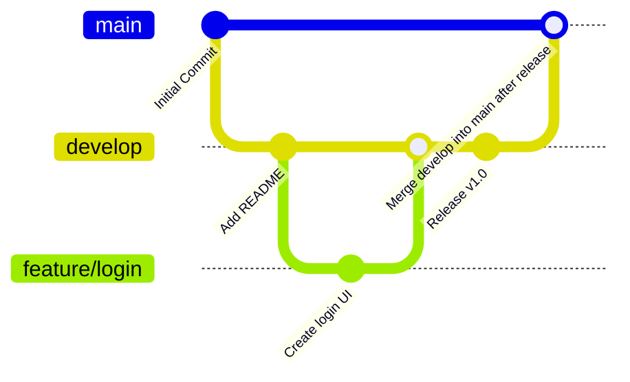

This repo is a personal learning log for mastering Git and GitHub Actions, with a focus on applying CI/CD workflows to detection engineering projects and mastering devsecops.

## Code Deployment (CI/CD)
Automate code testing, building and deployment

## Code & Repo Management
Automate code reviews, issue management etc.

## Crash Course in Git
Allows us to manage source code changes:
- Save code snapshots: **commits**
- Work with alternative code versions: **branches**
- Move btwn branches & commits: **checkout**
- Cloud Git repo storage: **push & pull**
- Move between commits: **git checkout <id>**
- Code mgmt & collaborative devpt: issues, projects, PRs
- Automation & CI/CD: GitHub Actions

### Git Workflow
- git add <file(s)> or .
- git commit
- git push

### Common git commit message formats
- feat: a new feature
- fix: a bug fix
- docs: documentation only changes
- style: formatting
- test: add missing tests
- chore: changes to the build process/auxiliary tools

Examples:
```
feat(ci): add initial GitHub Actions workflow for CI

fix(gitignore): exclude .env files from version control

docs(readme): add learning objectives for Git and GitHub Actions

refactor(workflow): rename job steps for clarity
```

Points to note:
- Use imperative mood e.g. add
- Use present tense

### Undo commits
Use git revert \<id>
This is used to revert changes of commit by creating a new commit

### Resetting code
`git reset --hard <id>` is used to undo changes by deleting all commits since \<id>.  
We end up losing history with this

### Ignoring files with .gitignore
Allows us to specify folders and files to ignore
For example, if using MacOS and VS code, the .gitignore would look like:
```
.vscode
.DS_Store
```

### 🪾Branches



Creating a new branch `git branch <name>`  
We then need to change to the branch using `git checkout <name>`.  

We could also do the same faster using `git checkout -b <name>` to create and switch to the new branch instantaneously

After working on some code in the new branch, we can merge branches using `git merge <name>`


To delete a branch we use `git branch -D <name>`

### Creating a Personal Access Token
Profile → Settings → Developer Settings → Personal access tokens

Generate new token (repo)

Copy the token and paste it into the password on VS Code.

### Collaborating with Others

To merge branches we create a **pull request**
Create a new pull request, then select base as *main* and the compare as your branch i.e. *feat-my-fancy-code*

Then click **Create Pull Request**

Provide a title and well thought out description (or follow instructions provided by the repo owner)

Then, click **Create Pull Request** again

#### Using Forks
Click Fork, then create fork

Then clone it locally using `git clone`

Set the URL by running `git remote set-url origin <URL>`

Run `git checkout -b feat/my-new-feature`

Then write out your code, stage the changes and commit them

Push your code using `git push origin feat/my-new-feature`

Go to original repo and open a PR.

Then choose the base repo as the main one and the main branch as the base, and your repo and the source and compare branch.

Add a descriptive title and message (following contribution guidelines) and Create the Pull Request


