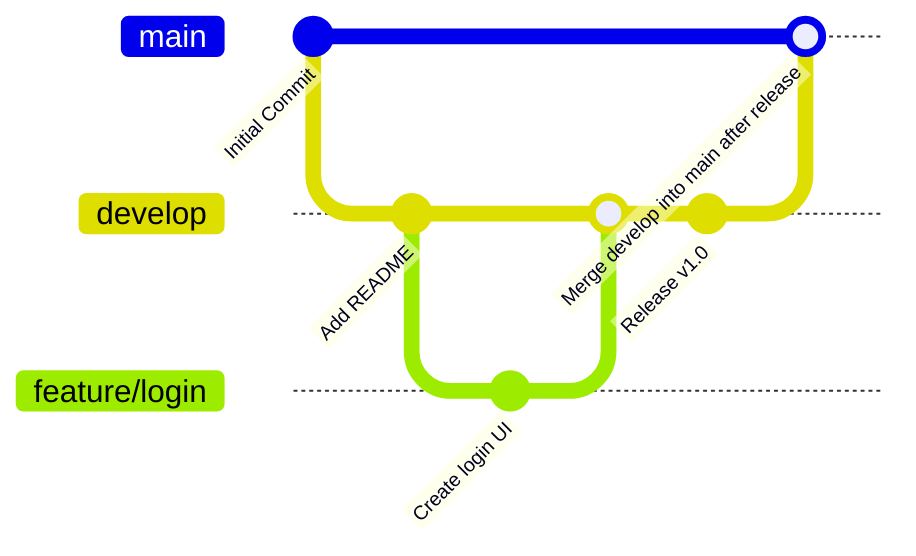
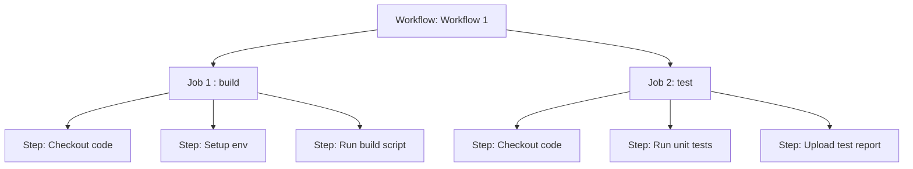

# GitHub Actions & Detection-as-Code
This repo is a personal learning log for mastering Git and GitHub Actions, with a focus on applying CI/CD workflows to detection engineering projects and mastering devsecops.

### 🛠️ Why This Matters
Mastering these skills will help me automate and scale detection engineering efforts using secure, repeatable and version-controlled workflows.

## Code Deployment (CI/CD)
Automate code testing, building and deployment

## Code & Repo Management
Automate code reviews, issue management etc.

## Crash Course in Git
Allows us to manage source code changes:
- Save code snapshots: **commits**
- Work with alternative code versions: **branches**
- Move btwn branches & commits: **checkout**
- Cloud Git repo storage: **push & pull**
- Move between commits: **git checkout <id>**
- Code mgmt & collaborative devpt: issues, projects, PRs
- Automation & CI/CD: GitHub Actions

### Git Workflow
- git add <file(s)> or .
- git commit
- git push

### Common git commit message formats
- feat: a new feature
- fix: a bug fix
- docs: documentation only changes
- style: formatting
- test: add missing tests
- chore: changes to the build process/auxiliary tools

Examples:
```
feat(ci): add initial GitHub Actions workflow for CI

fix(gitignore): exclude .env files from version control

docs(readme): add learning objectives for Git and GitHub Actions

refactor(workflow): rename job steps for clarity
```

Points to note:
- Use imperative mood e.g. add
- Use present tense

### Undo commits
Use git revert \<id>
This is used to revert changes of commit by creating a new commit

### Resetting code
`git reset --hard <id>` is used to undo changes by deleting all commits since \<id>.  
We end up losing history with this

### Ignoring files with .gitignore
Allows us to specify folders and files to ignore
For example, if using MacOS and VS code, the .gitignore would look like:
```
.vscode
.DS_Store
```

### 🪾Branches



Creating a new branch `git branch <name>`  
We then need to change to the branch using `git checkout <name>`.  

We could also do the same faster using `git checkout -b <name>` to create and switch to the new branch instantaneously

After working on some code in the new branch, we can merge branches using `git merge <name>`


To delete a branch we use `git branch -D <name>`

### Creating a Personal Access Token
Profile → Settings → Developer Settings → Personal access tokens

Generate new token (repo)

Copy the token and paste it into the password on VS Code.

### Collaborating with Others

To merge branches we create a **pull request**
Create a new pull request, then select base as *main* and the compare as your branch i.e. *feat-my-fancy-code*

Then click **Create Pull Request**

Provide a title and well thought out description (or follow instructions provided by the repo owner)

Then, click **Create Pull Request** again

#### Using Forks
Click Fork, then create fork

Then clone it locally using `git clone`

Set the URL by running `git remote set-url origin <URL>`

Run `git checkout -b feat/my-new-feature`

Then write out your code, stage the changes and commit them

Push your code using `git push origin feat/my-new-feature`

Go to original repo and open a PR.

Then choose the base repo as the main one and the main branch as the base, and your repo and the source and compare branch.

Add a descriptive title and message (following contribution guidelines) and Create the Pull Request


## GitHub Actions
### Building Blocks & Components
The most important parts are:
- Workflows
- Jobs
- Steps

How do these relate?
- We can have a **workflow** in a GitHub repo that has 1 or more **jobs**; each job can have 1 or more **steps**
<br></br>

<br></br>
Workflows are triggered by *Events*.  
We define a **Runner** (execution env) within a *Job*; and they contain one or more Steps to run on that runner.
They run in parallel (default) or sequential and can be conditional.   
Steps will execute a shell script or an action. These can be custom or 3P actions.   
Steps are executed in order.

### Example GitHub Action file
Github workflows would be found at `.github/workflows/`.  
A sample workflow,called first-action.yml is as follows:
```yaml
name: First Workflow
on: workflow_dispatch
jobs:
   first-job:
      runs-on: ubuntu-latest
      steps:
         - name: Print greeting
           run: echo "Hello World!"
         - name: Print goodbye
           run: echo "Done - Sayonara!"
```

Then click Start Commit and commit new file.   
GitHub Action files are part of your code and hence are considered commits.   
If we want to run multiple commands we can use the pipe symbol after the run key:
```yaml
run: |
   echo "Something"
   echo "Something else"
```

### Events (Workflow Triggers)
These could be Repository-related (non-exhaustive):
- push
- pull_request
- create
- fork
- issues
- issue_comment
- watch
- discussion

Others:
- workflow_dispatch (manually trigger workflow)
- repository_dispatch
- schedule
- workflow_call

⭐️ More events can be found [here](https://docs.github.com/en/actions/reference/events-that-trigger-workflows)

### Using Actions in Workflows
Action: An application that performs a (typically complex), frequently repeated task.   
You can build your own or use official/community actions.   
Command "run": A (typically simple) shell command defined by you.

⭐️ More actions can be found [here](https://github.com/marketplace?type=actions)

Example of an action:
```yaml
name: Test Project
on: push
jobs:
   test:
      runs-on: ubuntu-latest
      steps:
         - name: Get code
           uses: actions/checkout@v3
         - name: Install dependencies
           run: npm ci
         - name: Run tests
           run: npm test
```

### Failing & Analyzing Workflows
We can check results on the workflow in GitHub and either fix the code accordingly.

### Adding Multiple Jobs
Let's say we would like to deploy to a server after pushing, we can add a that as another job:

```yaml
name: Deploy Project
on: push
jobs:
   test:
      runs-on: ubuntu-latest
      steps:
         - name: Get code
           uses: actions/checkout@v3
         - name: Install dependencies
           run: npm ci
         - name: Run tests
           run: npm test
   deploy:
      needs: test
      runs-on: ubuntu-latest
      steps:
         - name: Get code
           uses: actions/checkout@v3
         - name: Install dependencies
           run: npm ci
         - name: Build project
           run: npm run build
         - name: Deploy
           run: echo "Deploying to the world..."
```

‼️ Remember, every job gets its own runner i.e., it's own VM that is totally isolated from other machines or jobs.

### Parallel vs Sequential Jobs
Jobs run in parallel by default.  
To get a job to run after another, we can use the `needs` keyword as seen above in the deploy job.  

### Using Multiple Triggers or Events
Let's say we want multiple triggers e.g.,  we want to both trigger a job on push as well as have a manual interaction we can wrap the events in square brackets as follows `on: [push, workflow_dispatch]`

### Expresssion & Context Objects
Output.yaml
```yml
name: Output information
on: workflow_dispatch
jobs:
   info:
      runs-on: ubuntu-latest
      steps:
        -  name: Output GitHub context
           run: echo "${{ toJSON(github) }}"
```


## Sentinel with IaC
IaC is managing and provision infra through code instead of manual processes.

### Repositories
Allows us to automate deployment and mgmt of Sentinel content through repo like GitHub & Azure DevOps.  
Supported content types:
- Analytics rules
- Threat hunt queries
- Automation rules
- Playbooks
- Parsers
- Workbooks (visualization)

### Managing Sentinel with Azure ARM Templates
ARM is not cloud agnostic and is completely Azure specific.   
ARM == Azure Resource Manager.  
JSON files that represent resources as code.  

### Managing Sentinel with Azure Bicep
Domain-specific language that uses declarative syntax to deploy Azure resources.  
Only works in Azure.  

###  Managing Sentinel with Terraform
Cloud agnostic IaC language.  
